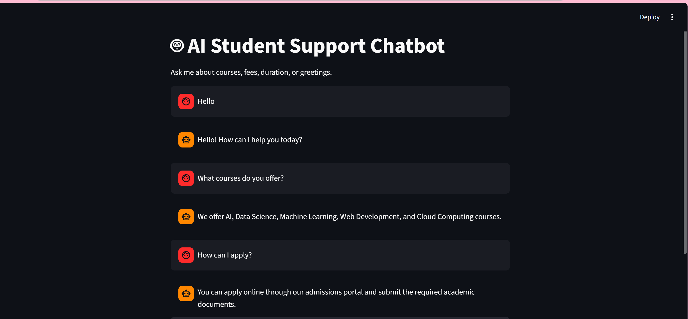

# OptimusAutomate_StudentSupportChatbot
# 🤖 AI Student Support Chatbot

A rule-based AI chatbot developed using **Python** and **Streamlit** to assist students by answering frequently asked questions related to courses, admissions, fees, placements, scholarships, and contact information. The chatbot uses intent recognition, context tracking, and an interactive chat interface.

---

## 📖 Project Overview

This project implements a rule-based chatbot that helps students obtain quick answers to common academic and admission-related questions. The chatbot recognizes user intent by matching input against predefined patterns stored in a JSON knowledge base and maintains conversational context for a smoother user experience.

---

## ✨ Features

- 🤖 Rule-based chatbot
- 💬 Interactive chat interface using Streamlit
- 🧠 Intent recognition using pattern matching
- 🔄 Multi-turn conversation support
- 📌 Context tracking using Streamlit Session State
- 🎓 Student FAQ assistance
- ⚡ Fast and lightweight implementation

---

## 🛠 Technologies Used

- Python
- Streamlit
- JSON
- Natural Language Processing (Pattern Matching)
- Streamlit Session State
- Random Library

---

## 🧠 How It Works

1. Loads chatbot intents from `intents.json`.
2. Accepts user input through the Streamlit chat interface.
3. Matches the user's query with predefined intent patterns.
4. Selects an appropriate response from the knowledge base.
5. Maintains conversation context for follow-up questions.
6. Displays the conversation in a user-friendly chat interface.

---

## 💬 Supported Queries

The chatbot can answer questions related to:

- 👋 Greetings
- 📚 Course Information
- 💰 Fee Structure
- ⏳ Course Duration
- 📝 Admissions
- 💼 Placements
- 🎓 Scholarships
- 📞 Contact Information
- 👋 Goodbye Messages

---

## 📷 Project Demo

### Chatbot Interface



---

## 📂 Repository Structure

```text
StudentSupportChatbot/
│
├── app.py
├── intents.json
├── requirements.txt
├── chatbot_demo.png
└── README.md
```

---

## 🚀 How to Run

### 1. Clone the repository

```bash
git clone https://github.com/your-username/OptimusAutomate_StudentSupportChatbot.git
```

### 2. Navigate to the project folder

```bash
cd OptimusAutomate_StudentSupportChatbot
```

### 3. Install the required libraries

```bash
pip install -r requirements.txt
```

### 4. Run the application

```bash
streamlit run app.py
```

---

## 📈 Results

- Successfully recognizes predefined user intents.
- Provides instant responses to frequently asked student queries.
- Supports multi-turn conversations with context tracking.
- Clean and interactive web interface using Streamlit.
- Easy to extend by adding new intents and responses.

---

## 🎯 Learning Outcomes

Through this project, I learned:

- Rule-based chatbot development
- Intent recognition
- Context tracking
- JSON data handling
- Streamlit application development
- Natural Language Processing fundamentals
- User interface development for AI applications

---

## 🔮 Future Improvements

- Integrate an LLM API (OpenAI or Gemini)
- Add voice input and speech synthesis
- Connect to a database for dynamic FAQs
- Implement authentication for personalized responses
- Deploy the chatbot to the cloud

---

## 👨‍💻 Author

**Abeer Bilal**

Developed as part of the **Optimus Automate AI Internship**.
